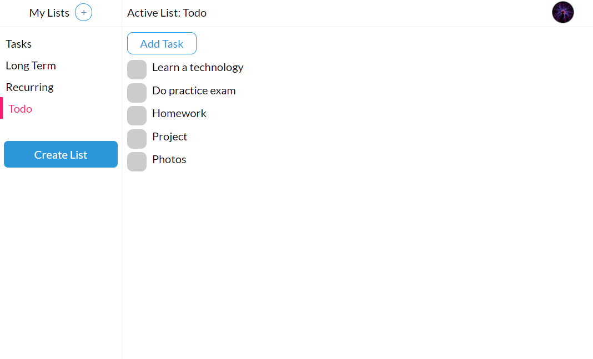

<div id="top"></div>

<!-- PROJECT LOGO -->
<br />
<div align="center">
<h3 align="center">Electron Tasks</h3>

  <p align="center">
    A Desktop Client for <br> Google Tasks
    <br />
    <br />
    <small>* In Development*</small>
  </p>
</div>

<!-- TABLE OF CONTENTS -->

<!-- ### Contents:

-   [About the Project](#-about-the-project)
    -   [Inspiration](#inspiration)
    -   [Challenges](#challenges)
    -   [Built With](#built-with)
-   [Getting Started](#-getting-started)
-   [Usage](#-usage)
-   [Contact](#-contact)
-   [License](#-license)
-   [Acknowledgement](#-acknowledgement) -->

<!-- ABOUT THE PROJECT -->

## 💡 About The Project



### Inspiration

Being an avid user of Google Tasks, I found the lack of a desktop client to be an inconvenience. Whenever I needed to access my todo lists on my laptop, it would take me quite a few seconds to would have to navigate to my task lists.
<br>
So how did I go about saving myself those few seconds a day?
<br/>
I spent hours building a desktop client for Google Tasks, of course.

<!-- ### Challenges
The first big challenge I faced was setting up the project and integrating the different technologies with each other. My first iteration of the project couldn't run the Electron.js desktop client without a seperate instance of the project running in the background. While switching 

Learning to use Google's APIs was extremely challenging. Many of the API features lacked detailed documentation, which made the endpoints difficult to use. To figure out the  -->

### Built With

-   [React.js](https://reactjs.org/)
-   [Redux Toolkit](https://redux-toolkit.js.org/)
-   [Next.js](https://nextjs.org/)
-   [Electron](https://www.electronjs.org/)
-   [Typescript](https://www.typescriptlang.org/)
-   [Google OAuth2](https://developers.google.com/identity)
-   [Google Tasks API](https://developers.google.com/tasks)

<p align="right">(<a href="#top">back to top</a>)</p>

<!-- GETTING STARTED -->

## 🚀 Getting Started

To get a local copy up and running follow these steps.

### Prerequisites

NPM is required to run this project.

```sh
npm install npm@latest -g
```

### Setup

1. Create a new project on the [Google Cloud Platform](https://console.developers.google.com/).
2. Navigate to the project's Library tab, and enable Tasks API (not Cloud Tasks API).
3. In the Credentials tab, create an API key AND a web application OAuth client ID.
4. Inside your client ID settings, add `http://locahost:8000` to the authorized JavaScript origins and Authorized redirect URIs.
5. Finally, Navigate to the OAuth consent screen. Besides filling out the required information, add the scope Tasks API (../auth/tasks).

### Installation

1. Clone the repo
    ```sh
    git clone https://github.com/pillious/Electron-Tasks.git
    ```
2. Install NPM packages
    ```sh
    npm install
    ```
3. Create a `.env.local` file inside the `./renderer` folder.
4. Enter your Google Cloud project secrets in `.env.local`
    ```
    NEXT_PUBLIC_CLIENT_ID=your_api_key
    NEXT_PUBLIC_API_KEY=your_api_key
    ```
5. Run the project
    ```sh
    npm run dev
    ```

<p align="right">(<a href="#top">back to top</a>)</p>

<!-- USAGE EXAMPLES -->

<!-- ## Usage

Use this space to show useful examples of how a project can be used. Additional screenshots, code examples and demos work well in this space. You may also link to more resources.

_For more examples, please refer to the [Documentation](https://example.com)_

<p align="right">(<a href="#top">back to top</a>)</p> -->

<!-- LICENSE -->

## ⚖️ License

Distributed under the MIT License. See `LICENSE.txt` for more information.

<!-- CONTACT -->

## 🎯 Contact

Andrew Lee (pillious) - andrewzhlee@gmail.com
<br>
([My Website](https://andrewzh.com))

<!-- ACKNOWLEDGMENTS -->

## 📚 Acknowledgments

-   [Electron Template with Next.js & Typescript](https://github.com/vercel/next.js/tree/canary/examples/with-electron-typescript)

<p align="right">(<a href="#top">back to top</a>)</p>
